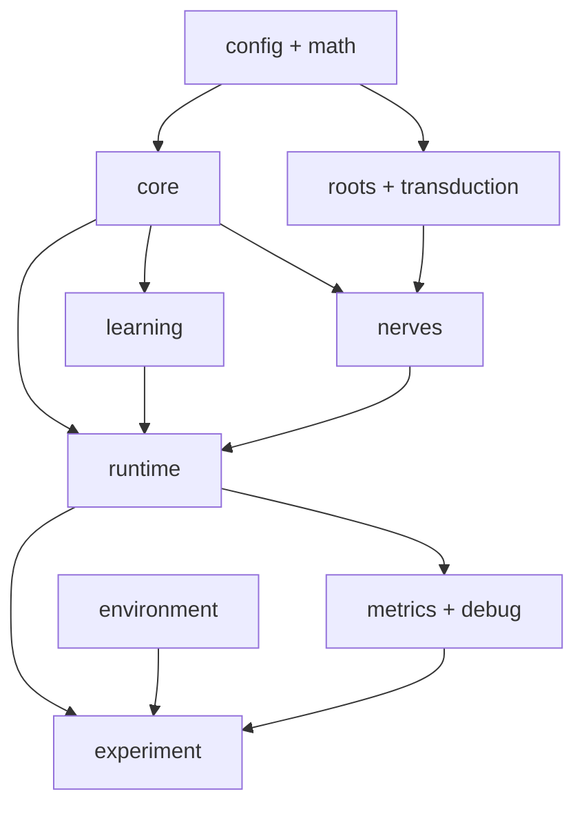

# NERVA – Slice-Architektur und Logikbeschreibung

**NERVA — Neural Emergent Reactive & Versatile Architectur**

**Stand:** 20. August 2026
**Ziel:** Eine Rust-Bibliothek für ein ereignisbasiertes, räumliches Spiking-Netz mit lokalen Lernregeln.

## 1. Architekturentscheidung

NERVA wird zunächst als **ein Rust-Crate** gebaut. Die Slices sind Module innerhalb der Bibliothek und noch keine getrennten Crates oder Services.

Die erste Version, **NERVA-M0**, beantwortet nur eine Frage:

> Kann ein kleines rekurrentes Spiking-Netz mit lokalem Pair-STDP eine wiederkehrende zeitliche Sequenz stabil lernen?

M0 enthält noch keine Morphogenfelder, Zellteilung, Migration oder frei wachsenden Axone. Diese Mechanismen folgen erst, wenn die grundlegende Spike-, Lern- und Stabilitätslogik nachweislich funktioniert.

## 2. Feste Grundregeln

1. Es gibt **keinen globalen Simulationstick**. Ereignisse tragen präzise Zeitstempel.
2. Ein technischer Scheduler ordnet Ereignisse, entscheidet aber nicht über Lernen oder Netzstruktur.
3. Ein Neuron empfängt ausschließlich synaptische beziehungsweise über Nerven eingespeiste Spike-Ereignisse. Es kennt keine Texte, Pixel, Bytes oder Aufgaben.
4. Lernen verwendet nur lokal verfügbare Informationen: Prä-Spikes, Post-Spikes, lokale Spuren, das eigene Gewicht und den lokalen Zellzustand.
5. Keine Backpropagation, kein globaler Loss und in M0 kein Dopamin- oder Belohnungssignal.
6. `NeuronId` ist die Identität eines Neurons. Seine Vektorposition beschreibt nur Geometrie, Distanz, Leitungslänge und Visualisierung.
7. Sensor- und Motoranschlüsse sowie ihre Nervenfasern sind anfangs fest. Die internen synaptischen Verbindungen können lernen.
8. Exzitatorische und inhibitorische Wirkung werden über die Polarität der sendenden Zelle festgelegt; ein Lernschritt darf das Vorzeichen nicht umdrehen.
9. Debugging und Metriken dürfen alles beobachten, aber keinen Simulationszustand verändern.
10. Jeder Versuch muss mit einem Seed reproduzierbar sein.

## 3. Datenfluss


Eingangs-, internes und Ausgangs-Subnetz sind keine getrennten Engines. Sie
sind Populationen desselben `core::Network` und verwenden dieselbe Spike-,
Plastizitäts- und spätere Entwicklungslogik. Roots, Transduktion und Nerven
bilden nur die stabilen Anschlüsse an konkrete Sensoren und Aktoren.

Lernen liegt nicht als zusätzlicher Knoten im Nutzdatenpfad. Der Runtime-Slice meldet lokale Prä- und Post-Ereignisse an die Lernregel. Diese darf nur die jeweils betroffenen Synapsen oder Neuronen verändern.

## 4. Ordnerstruktur

```text
nerva/
├── Cargo.toml
├── src/
│   ├── lib.rs
│   ├── config/
│   │   ├── mod.rs
│   │   ├── network.rs
│   │   ├── runtime.rs
│   │   └── learning.rs
│   ├── math/
│   │   ├── mod.rs
│   │   ├── position.rs
│   │   └── decay.rs
│   ├── primitives/           # elementare Typen ohne Fachlogik
│   │   ├── mod.rs
│   │   ├── ids.rs
│   │   ├── time.rs
│   │   ├── signal.rs
│   │   ├── potential.rs
│   │   ├── weight.rs
│   │   ├── position.rs
│   │   └── concentration.rs
│   ├── core/
│   │   ├── mod.rs
│   │   ├── ids.rs
│   │   ├── neuron.rs
│   │   ├── synapse.rs
│   │   ├── spike.rs
│   │   ├── event.rs
│   │   └── network.rs
│   ├── runtime/
│   │   ├── mod.rs
│   │   ├── scheduler.rs
│   │   ├── simulation.rs
│   │   ├── propagation.rs
│   │   └── event_batch.rs
│   ├── learning/
│   │   ├── mod.rs
│   │   ├── rule.rs
│   │   ├── pair_stdp.rs
│   │   ├── traces.rs
│   │   ├── homeostasis.rs
│   │   └── bounds.rs
│   ├── roots/
│   │   ├── mod.rs
│   │   ├── root.rs
│   │   ├── sensory.rs
│   │   ├── motor.rs
│   │   └── registry.rs
│   ├── transduction/
│   │   ├── mod.rs
│   │   ├── encoder.rs
│   │   ├── decoder.rs
│   │   ├── pattern_encoder.rs
│   │   └── types.rs
│   ├── nerves/
│   │   ├── mod.rs
│   │   ├── fiber.rs
│   │   ├── bundle.rs
│   │   ├── mapping.rs
│   │   └── routing.rs
│   ├── environment/
│   │   ├── mod.rs
│   │   ├── environment.rs
│   │   └── bit_world.rs
│   ├── development/          # erst ab M1
│   │   ├── mod.rs
│   │   ├── organizer.rs
│   │   ├── field.rs
│   │   ├── cell_state.rs
│   │   ├── differentiation.rs
│   │   └── growth.rs
│   ├── metrics/
│   │   ├── mod.rs
│   │   ├── collector.rs
│   │   ├── firing.rs
│   │   ├── weights.rs
│   │   └── sequence.rs
│   ├── debug/
│   │   ├── mod.rs
│   │   ├── observer.rs
│   │   ├── event_log.rs
│   │   └── snapshot.rs
│   ├── experiment/
│   │   ├── mod.rs
│   │   ├── runner.rs
│   │   ├── sequence_m0.rs
│   │   └── comparison.rs
│   └── visualization/
│       ├── mod.rs
│       └── export.rs
├── tests/
│   ├── neuron_dynamics.rs
│   ├── propagation.rs
│   ├── pair_stdp.rs
│   ├── deterministic_replay.rs
│   └── m0_sequence.rs
└── examples/
    └── m0_sequence.rs
```

`development/` wird bereits als Grenze vorgesehen, aber seine Logik bleibt in M0 deaktiviert. So muss der funktionierende Core später nicht umgebaut werden.

`primitives/` enthält ausschließlich Identitäten, die mikrosekundengenaue
Simulationszeit, typisierte Skalarwerte und Positionen. `NeuronId`, `SynapseId`,
`SimTime` und `Position3` sind dort kanonisch definiert. Die bisherigen Pfade
über `core` beziehungsweise `math::Position3D` bleiben kompatible Re-Exports.
Die typisierten Skalarwerte bereiten eine schrittweise Migration vor; aktive
M0-Pfade verwenden teilweise weiterhin `f32` und werden jeweils vollständig
über alle beteiligten Schichten umgestellt.

## 5. Slices und ihre Verantwortung

| Slice | Aufgabe | Darf nicht |
|---|---|---|
| `primitives` | Identitäten, Zeit, Fachwerte und Positionen typisieren | Neuronen-, Netzwerk-, Event-, Runtime- oder Lernlogik enthalten |
| `config` | Validierte Parameter und Seeds bereitstellen | Laufzeitzustand oder Lernlogik enthalten |
| `math` | Positionen, Distanzen und zeitlichen Zerfall berechnen | Neuronen oder Netzwerke verwalten |
| `core` | Neuronen, Synapsen, Spikes, IDs und Graphzustand darstellen | Scheduler, Sensorformate oder konkrete Lernregel kennen |
| `learning` | Lokale synaptische und zelluläre Plastizität anwenden | Die gesamte Aktivität oder globale Fehlerwerte auswerten |
| `development` | Spätere lokale Entwicklung, Differenzierung und Wachstum kapseln | Als globaler Bauplan konkrete Synapsen befehlen |
| `runtime` | Ereignisse kausal und deterministisch ausführen | Ein Lernziel oder eine Netzstruktur vorgeben |
| `roots` | Stabile Sensor- und Motoranschlüsse nach außen darstellen | Interne Netztopologie oder STDP verwalten |
| `transduction` | Rohdaten in Spike-Muster und Motor-Spikes in Ausgaben übersetzen | Direkt Neuronenzustände setzen |
| `nerves` | Fasern, Bündel, feste Zuordnungen und Leitungsverzögerungen verwalten | Bedeutung der transportierten Signale interpretieren |
| `environment` | Test- oder reale Umgebungen über ein neutrales Interface anbinden | Bestandteil der neuronalen Lernlogik sein |
| `metrics` | Messergebnisse aus Ereignissen berechnen | Simulation beeinflussen |
| `debug` | Ereignisprotokolle und Snapshots erzeugen | Fachlogik besitzen |
| `experiment` | Konfigurationen, Wiederholungen und Kontrollen orchestrieren | Lernregeln innerhalb eines Versuchs heimlich verändern |
| `visualization` | Zustände in neutrale Exportformate schreiben | Teil der Simulation sein |

## 6. Logik der einzelnen Slices

### 6.1 `config`

Dieser Slice enthält unveränderliche, validierte Startparameter:

- Membranzeitkonstante, Ruhepotential, Schwelle, Reset und Refraktärzeit
- Anzahl exzitatorischer und inhibitorischer Neuronen
- Verbindungswahrscheinlichkeit und Seed
- minimale und maximale Gewichte
- STDP-Fenster, Lernraten und Spurzeitkonstanten
- Leitungsgeschwindigkeit und Distanzabschwächung
- lokale Homöostaseparameter
- kontinuierliche intrinsische Gains und ihre Zeitkonstanten für Drive, Burst,
  Adaptation, Schwellenadaptation und Rebound

Beim Start werden unmögliche Kombinationen abgewiesen, etwa negative Zeitkonstanten, `min_weight > max_weight` oder eine Leitungsgeschwindigkeit von null.

### 6.2 `math`

`math` bietet reine Funktionen ohne versteckten Zustand.

Die Membranspannung wird zwischen zwei Ereignissen analytisch fortgeschrieben:

\[
V(t)=V_{rest}+(V(t_0)-V_{rest})e^{-(t-t_0)/\tau_m}
\]

Mit aktiven intrinsischen Fähigkeiten wird dieselbe LIF-Gleichung um lokale,
exponentiell zerfallende Ströme ergänzt:

\[
\dot V=-\frac{V-V_{rest}}{\tau_m}+D+B+R-A
\]

Die effektive Schwelle lautet dabei

\[
\theta_{eff}=\theta_{base}+T.
\]

Die Faltung jedes Stroms mit dem Membranzerfall wird geschlossen berechnet;
Zwischenereignisse verändern das Ergebnis daher nicht.

Die räumliche Dämpfung kann für M0 beispielsweise so berechnet werden:

\[
a(d)=e^{-d/\lambda}
\]

Damit ergibt sich die ankommende Stärke aus `weight × attenuation(distance)`. Die Position ist keine Adresse und erzeugt keine feste Gehirnregion.

### 6.3 `core`

Der Core ist das Zustandsmodell des neuronalen Gewebes.

#### `Neuron`

Ein Neuron enthält mindestens:

- `NeuronId`
- `Position3D`
- Polarität: exzitatorisch oder inhibitorisch
- optionale Rolle als Metadatum, etwa sensorisch oder motorisch
- unveränderliche Zellparameter
- Membranpotential und Zeitpunkt der letzten Aktualisierung
- `refractory_until`
- lokale Aktivitätsspuren
- kontinuierliche lokale Zustände für Burst, Adaptation, Rebound und
  Schwellenadaptation

Die Rolle darf keine versteckte Speziallogik auslösen. Ein Motorneuron verwendet dieselbe Spike-Dynamik wie andere Neuronen; nur seine Verbindung zu einer Motorwurzel ist besonders.

Ein Spike gibt `B`, `A` und `T` die jeweils konfigurierten Impulse. Ein
inhibitorischer Eingangsimpuls erzeugt direkt nach dem atomaren Batch einen
positiven Rebound-After-Current `R`. Alle vier Zustände zerfallen mit eigenen
Zeitkonstanten. Null-Gains ergeben exakt das bisherige LIF-Neuron; Kombinationen
der Gains bilden einen kontinuierlichen Verhaltensraum statt fester Klassen wie
„BurstNeuron“ oder „AdaptiveNeuron“.

#### `Synapse`

Eine Synapse enthält mindestens:

- `SynapseId`, `pre`, `post`
- Gewicht
- Übertragungsverzögerung
- `plastic` und `enabled`
- lokale Prä-Spur und gegebenenfalls Nutzungsstatistik

#### `Network`

`Network` hält den dünn besetzten gerichteten Graphen und schnelle Indizes für ein- und ausgehende Synapsen. Es führt selbst keine Simulation aus.

### 6.4 `runtime`

Die Runtime besitzt eine nach Zeit sortierte Ereigniswarteschlange. Ereignisse werden nach `(timestamp, insertion_sequence)` deterministisch geordnet.

Alle Ereignisse mit exakt demselben Zeitstempel werden als Batch behandelt:

1. Betroffene Neuronen werden analytisch bis zur Ereigniszeit fortgeschrieben.
2. Gleichzeitig eintreffende Beiträge werden pro Zielneuron summiert.
3. Die Summe wird auf das Membranpotential angewendet.
4. Danach wird einmalig geprüft, welche Neuronen feuern.
5. Spikes, lokale Lernereignisse und neue Übertragungsereignisse werden erzeugt.
6. Erst anschließend wird der nächste Zeitstempel bearbeitet.

Dadurch entscheidet nicht die zufällige Reihenfolge gleichzeitig eintreffender Spikes über das Ergebnis.

Neben Netto- und Gesamtbetrag hält das Batch intern auch den Betrag aller
inhibitorischen Beiträge. Dadurch bleibt Rebound bei gleichzeitig eintreffender
Erregung sichtbar. Nach jedem betroffenen Batch prognostiziert ausschließlich
das jeweilige Neuron seine nächste autonome Schwellenüberschreitung. Eine
chronologische Intervallsuche verwirft nur Zeiträume, deren analytische Bounds
eine Überschreitung ausschließen; es gibt weder einen festen Suchhorizont noch
einen globalen Dynamiktick.

Beim Feuern eines Neurons:

1. wird ein `Spike` mit genauer Zeit erzeugt,
2. das Potential auf den Resetwert gesetzt,
3. `refractory_until` gesetzt,
4. Burst-, Adaptations- und Schwellenadaptationszustand lokal aktualisiert,
5. für jede aktive ausgehende Synapse ein `SynapticArrival` bei `time + delay` geplant,
6. das Ereignis an Learning, Roots, Metrics und Debug weitergegeben.

Die erste Implementierung läuft absichtlich auf einem Thread. Parallelisierung folgt erst, wenn deterministischer Replay auf einem Thread korrekt funktioniert.

### 6.5 `learning`

Die Runtime bindet konkrete Lernregeln ausschließlich über ein kleines Trait aus `learning` ein. Der Core selbst kennt dieses Trait nicht:

```rust
pub trait PlasticityRule {
    fn on_pre_arrival(&mut self, synapse: &mut Synapse, post: &Neuron, time: SimTime);
    fn on_post_spike(&mut self, neuron: &Neuron, incoming: &mut [Synapse], time: SimTime);
}
```

Die konkrete Regel liegt vollständig in `learning`.

#### Pair-STDP in M0

Bei einem Prä-Spike wird die lokale Prä-Spur der Synapse erhöht. Feuert das Post-Neuron kurz danach, erfolgt LTP:

\[
\Delta w_+=A_+e^{-(t_{post}-t_{pre})/\tau_+}
\]

Kam der Post-Spike zuerst und der Prä-Spike danach, erfolgt LTD:

\[
\Delta w_-=-A_-e^{-(t_{pre}-t_{post})/\tau_-}
\]

Danach wird das Gewicht in seinem erlaubten Bereich begrenzt.

Für M0 gilt:

- Pair-STDP wirkt zunächst nur auf plastische, intern exzitatorische Synapsen.
- Inhibitorische Synapsen bleiben fest und stabilisieren das Netz.
- Eine eigene inhibitorische Plastizitätsregel kann später ergänzt werden.
- Keine Lernregel darf eine exzitatorische Synapse inhibitorisch oder umgekehrt machen.

#### Lokale Homöostase

Jedes Neuron führt langsam zerfallende, ausschließlich lokale Schätzungen seiner eigenen Feuerrate und der empfangenen absoluten Eingangsgröße. Ein lokales Wartungsereignis unterscheidet damit zwischen „ich erhalte genügend Input, feuere aber zu wenig“ und „ich erhalte zu wenig Input“:

- bei ausreichendem Input und zu wenig Output steigt der intrinsische Strom;
- bei zu wenig Input und zu wenig Output steigt ein lokaler `structural_drive` als Signal für einen späteren Growth-/Pruning-Slice;
- bei zu hoher Aktivität sinkt der intrinsische Strom, bei hoher Aktivität trotz fehlendem Input besonders stark.

Der intrinsische Strom ist eine zeitkontinuierliche Größe (Potential pro Sekunde), keine Addition pro Runtime-Update. Er verschiebt das LIF-Gleichgewicht analytisch über die tatsächlich verstrichene Simulationszeit. Dadurch hat dieselbe Konfiguration bei zwei oder zweihundert Zwischenereignissen denselben Effekt.

Wenn Homöostase aktiviert wird, besitzt jedes Neuron seinen eigenen nächsten Wartungszeitpunkt und plant nach Ausführung nur seinen eigenen Folgetermin. Die initialen lokalen Fristen entstehen aus einem festen Hash der Neuron-ID und sind damit auch bei sequentiellen IDs über das Intervall verteilt; es gibt keinen globalen Tick, der alle Neuronen aktualisiert. Beim Reaktivieren wird der Zeitanker jeder Zelle auf die aktuelle Simulationszeit gesetzt, damit eine deaktivierte Phase nicht als einmaliger großer Regelschritt nachgeholt wird. Eine positive intrinsische Erregbarkeit plant darüber hinaus einen lokalen, deterministischen Threshold-Crossing-Event – Random-Spikes sind nicht erforderlich. Ändert ein Input oder eine lokale Stromanpassung diese Vorhersage, wird der alte Queue-Eintrag sofort storniert, statt als fernes Stale-Event im Scheduler zu bleiben.

Homöostase wird in den Experimenten separat zu- und abgeschaltet, damit ihr Effekt messbar bleibt. `structural_drive` verändert in M0 noch keine Topologie; die tatsächliche Verbindungssuche gehört in den dafür vorgesehenen Entwicklungsslice nach M0.

### 6.6 `roots`

Eine Root ist ein stabiler Anschluss des neuronalen Systems an die Außenwelt.

Geplante Roots sind:

- `TextInputRoot`
- `VisionRoot`
- `AudioRoot`
- `BodySensorRoot`
- `MotorRoot`

M0 benötigt nur eine einfache `PatternInputRoot` und eine beobachtbare `MotorRoot`.

Eine Root besitzt Kanäle und verweist auf Nervenfasern. Sie setzt niemals direkt Membranpotentiale und kennt keine internen Synapsen.

### 6.7 `transduction`

Transduktion übersetzt ein externes Signal in zeitliche Aktivität.

Für das M0-Experiment ordnet der `PatternEncoder` jedem Muster `A`, `B`, `C` und `D` eine feste, dünn besetzte Gruppe sensorischer Fasern zu. Ein Muster erzeugt einen reproduzierbaren Spike-Zug, nicht einen direkten Zahlenvektor im Neuron.

Später können andere Encoder Bytes, Bilder, Audio oder Körpersensoren übersetzen, ohne den Core zu verändern.

Die Gegenrichtung übernimmt ein Decoder. Er beobachtet ausschließlich Spikes der zugeordneten Motorfasern und erzeugt daraus eine Ausgabe für die Umgebung.

### 6.8 `nerves`

Nerven sind feste Transport- und Zuordnungsstrukturen zwischen Roots und dem Core.

- Eine `Fiber` besitzt eine ID, eine Richtung, eine Verzögerung und ein Ziel beziehungsweise eine Quelle.
- Ein `Bundle` fasst zusammengehörige Fasern zusammen.
- `Mapping` verbindet sensorische Fasern mit Eingangsneuronen und Motorneuronen mit Ausgangsfasern.
- `Routing` wandelt einen Faserspike in ein Runtime-Ereignis um.

Nerven entscheiden nicht, was ein Signal bedeutet. Interne plastische Synapsen gehören in den Core, nicht in `nerves`.

#### Lernende Eingangs- und Ausgangsnetze

Die feste Nervenabbildung endet an einer sensorischen beziehungsweise
motorischen Neuronenpopulation. Diese Populationen sind äußere Subnetze des
gleichen `core::Network`, keine fest codierten Adapter:

```text
Sensor → fester Anschluss → lernendes Eingangsnetz
       → internes Netz → lernendes Ausgangsnetz → fester Anschluss → Aktor
```

`NeuronRole::Sensory` und `NeuronRole::Motor` bleiben reine Metadaten. Synapsen
innerhalb und zwischen diesen Populationen können deshalb dieselben lokalen
Lernregeln wie alle anderen Core-Synapsen verwenden. M0 startet noch mit einer
fest erzeugten Topologie; das selbstständige Bilden und Abbauen solcher
Verbindungen wird später durch lokale `development`-Mechanismen realisiert,
nicht durch `roots`, `transduction` oder `nerves`.

### 6.9 `environment`

Die Umgebung wird hinter einem kleinen Interface gekapselt:

```rust
pub trait Environment {
    fn observations(&mut self, until: SimTime) -> Vec<Observation>;
    fn apply_action(&mut self, action: Action);
}
```

Für M0 ist die Umgebung nur ein deterministischer Sequenzgenerator. Danach folgt eine kleine geschlossene `BitWorld`, bevor eine CLI-VM angebunden wird:

```text
VM-Terminalbytes → Transduktion → NERVA → Motorbytes → VM
```

Die VM ist ein Adapter und niemals Teil des neuronalen Lernkerns.

### 6.10 `development` – erst ab M1

Dieser Slice wird erst aktiviert, nachdem M0 erfolgreich ist.

Die derzeit wissenschaftlich sinnvolle Richtung lautet:

- wenige definierte frühe Organisator- oder Interfacepopulationen,
- lokale Diffusion, Aufnahme und Zerfall von Entwicklungsfeldern,
- lokale Reaktion einer Zelle auf Feldstärke, Dauer, Nachbarn und eigenen Zustand,
- lokale Differenzierung,
- Growth Cones, Synaptogenese und Pruning.

Organisatoren liefern nur grobe relative Bedingungen. Sie geben keine konkrete Netzstruktur und keine Lernentscheidung vor. Die zuvor verworfene Idee beliebiger, überall spontan entstehender Morphogenquellen gehört nicht in diesen Slice.

### 6.11 `metrics`, `debug` und `visualization`

Die Runtime veröffentlicht unveränderliche Beobachtungsereignisse, beispielsweise:

- `SpikeEmitted`
- `SynapticArrival`
- `WeightChanged`
- `HomeostasisChanged`
- `MotorOutput`

`metrics` berechnet daraus Messwerte. `debug` schreibt ein vollständiges Ereignisprotokoll und Zustands-Snapshots. `visualization` exportiert Positionen, Verbindungen, Gewichte und Spike-Zeiten, beispielsweise als JSON oder CSV.

Diese Slices erhalten nur lesende Daten. Dadurch kann das Einschalten von Logging oder Visualisierung das Experiment nicht verändern.

### 6.12 `experiment`

Dieser Slice baut reproduzierbare Versuche aus den anderen Slices zusammen. Er besitzt keine neuronale Fachlogik.

Jeder Versuch speichert:

- vollständige Konfiguration,
- Seed,
- Eingabefolge,
- aktive Lernregeln,
- Messwerte,
- optional Ereignislog und Snapshot.

## 7. Erlaubte Abhängigkeiten



Wichtige Verbote:

- `core` importiert weder `learning` noch `runtime`.
- `learning` importiert keine Umgebung, Roots oder Metriken.
- `roots` kennen keine konkrete Netzwerkstruktur.
- `metrics`, `debug` und `visualization` werden niemals von Core oder Learning aufgerufen, um Entscheidungen zu treffen.
- `experiment` darf Module konfigurieren und verbinden, aber keine privaten Zustände umgehen.

## 8. M0-Versuchslogik

### Trainingsfolge

```text
A → B → C → D → Pause → A → B → C → D → ...
```

Jedes Symbol aktiviert eine andere dünn besetzte Sensorgruppe. Zwischen Symbolen und Wiederholungen liegen fest konfigurierte Zeitabstände.

### Vergleichsgruppen

| Gruppe | Eingabe | Lernen |
|---|---|---|
| G1 | geordnet `A→B→C→D` | Pair-STDP an |
| G2 | geordnet `A→B→C→D` | Pair-STDP aus |
| G3 | dieselben Muster zufällig | Pair-STDP an |
| G4 | geordnet `A→B→C→D` | Pair-STDP + lokale Homöostase |

Alle Gruppen verwenden dieselbe initiale Netzstruktur und denselben Seed. Nur die jeweils untersuchte Variable wird geändert.

### Testphase

Nach dem Training werden Gewichte eingefroren. Das System erhält nur `A`. Anschließend wird geprüft, ob die interne Aktivität bevorzugt Zustände hervorruft, die zuvor mit `B`, `C` und `D` verbunden waren.

### Messwerte

- Übergangstreffer gegenüber falschen Übergängen
- zeitlicher Abstand der vorhergesagten Aktivität
- Unterschied zwischen geordnetem und zufälligem Training
- mittlere und neuronweise Feuerrate
- Anteil stiller und dauerhaft aktiver Neuronen
- Anteil minimaler und maximaler Gewichte
- Gewichtsänderung pro Synapsenklasse
- Stabilität nach Ende des Lernens
- deterministisch identisches Ergebnis bei erneutem Lauf mit gleichem Seed

### Erfolgskriterium

M0 gilt nicht schon dann als erfolgreich, wenn sich Gewichte verändern. Es gilt als erfolgreich, wenn:

1. G1 nach `A` signifikant häufiger die gelernte Reihenfolge aktiviert als G2 und G3,
2. das Netz dabei weder kollabiert noch in Dauerfeuer übergeht,
3. der Effekt mit eingefrorenen Gewichten wiederholbar bleibt,
4. ein identischer Seed ein identisches Ereignisprotokoll erzeugt.

## 9. Implementierungsreihenfolge

1. `config`, `math` und Core-Datentypen
2. analytische LIF-Neuronenlogik
3. Synapsen und statischer gerichteter Graph
4. deterministischer Event-Scheduler ohne Lernen
5. Spike-Übertragung mit Verzögerung und Distanzabschwächung
6. vollständiges Ereignislogging und Replay-Test
7. Pair-STDP mit isolierten Unit-Tests
8. Roots, Pattern-Transduktion und Nerven-Mapping
9. M0-Gruppen G1 bis G3
10. lokale Homöostase und Gruppe G4
11. BitWorld als erste geschlossene Sensor-Motor-Schleife
12. erst danach `development` mit Organisatoren, Feldern, Wachstum und Pruning

## 10. Bewusst nicht in M0

- globaler Tick
- Backpropagation oder globaler Loss
- Dopamin, Reward oder zentraler Aktionsplaner
- Morphogenfelder und Zellmigration
- Synaptogenese und Pruning
- Neurogenese
- spezialisierte gehirnähnliche Makroareale
- Milliarden Neuronen oder Mehrkernparallelisierung
- direkte Übergabe von Bytes oder Vektoren an Neuronen
- eine komplexe 3D-Drohnensimulation

Diese Begrenzung ist kein endgültiger Verzicht. Sie sorgt dafür, dass bei einem Fehlschlag eindeutig erkennbar bleibt, ob Neuronendynamik, Ereigniskausalität, STDP oder Stabilisierung die Ursache ist.

## 11. Öffentliche Bibliotheksgrenze

`lib.rs` exportiert nur die stabilen Bausteine:

```rust
pub mod config;
pub mod core;
pub mod environment;
pub mod experiment;
pub mod learning;
pub mod math;
pub mod nerves;
pub mod roots;
pub mod runtime;
pub mod transduction;

#[cfg(feature = "development")]
pub mod development;

#[cfg(feature = "diagnostics")]
pub mod debug;

#[cfg(feature = "diagnostics")]
pub mod metrics;

#[cfg(feature = "visualization")]
pub mod visualization;
```

Die zuerst zu implementierende vertikale Strecke lautet damit:

> `PatternInputRoot → PatternEncoder → SensoryNerve → EventScheduler → Core-Netz → Pair-STDP → Metrics`

Erst wenn diese Strecke samt Kontrollgruppen funktioniert, wird sie um Motorwurzel, geschlossene Umgebung und später Entwicklung erweitert.
